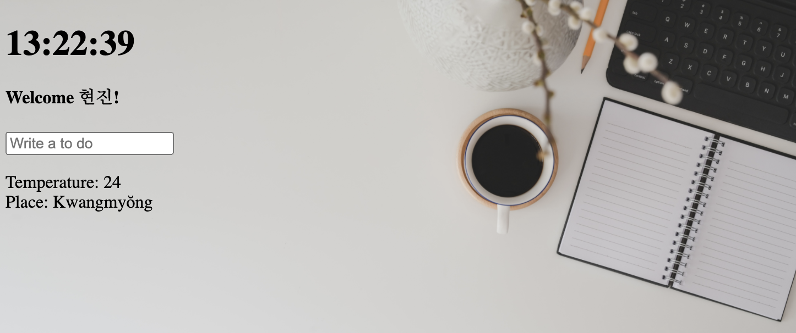

#  Application

### 서비스 소개
#### JavaScript를 공부하며 만든 간단한 'Application' 입니다.

  

🕐 시간을 알려요. 

📌 할 일을 기록해요. 

☀️ 날씨를 알 수 있어요. 

 

### 작업 설명
1. 현재 시간을 불러와 표시 
2. 시간이 1초마다 동기화 
setInterval(인자로 받을 함수, 함수를 실행하는 시간)
3. 시간 표시 시 10이하의 값은 01, 02, 03 등으로 표현 
4. Client로 부터 이름을 입력 받아 기억해 지속적으로 환영 문구를 띄움 
Local Storage에  이름 저장
5. 할 일을 입력하는 To-do List 생성 
Local Storage에 To-Do 저장
6. 배경 이미지 삽입 
7. 위치를 액세스 해 날씨 서비스 제공 
Local Storage에 위치 저장, 위치기반 날씨 서비스 API 사용
